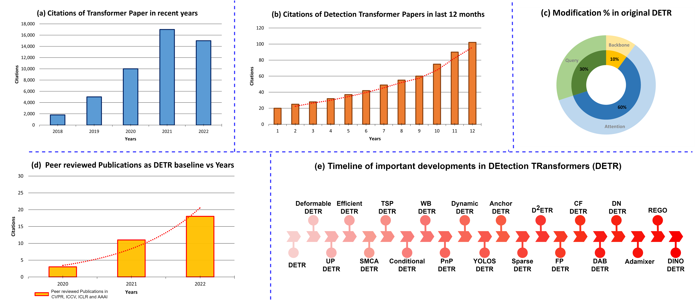
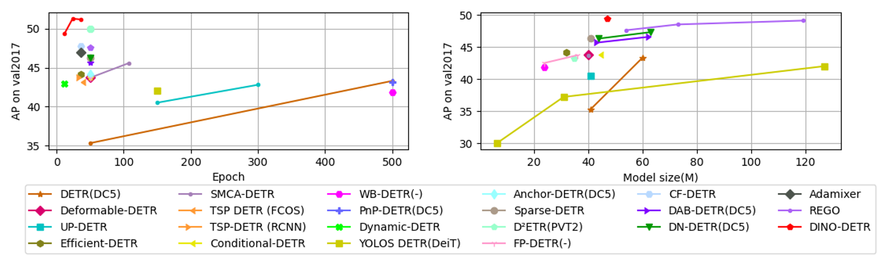
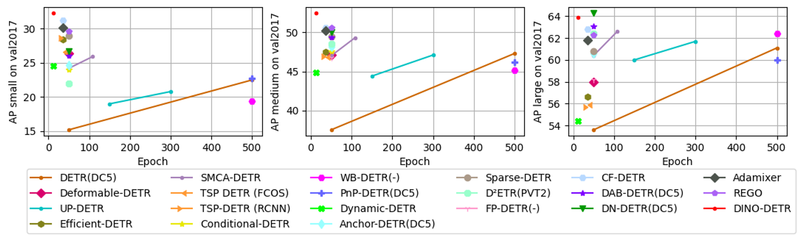

# A Repository of the Papers Addressing improvements in DEtection TRansformer (DETR)
This repository provides an up-to-date the list of studies addressing improvements in DEtection TRansformer (DETR). It follows the taxonomy provided in the following paper (please cite the paper if you benefit from this repository):

T. Shehzadi, K A. Hashmi, D. Stricker, M Z. Afzal, "Object Detection with Transformers: A Review"[[preprint]](https://arxiv.org/abs/2306.04670)

BibTeX entry:
```
@misc{shehzadi2023object,
      title={Object Detection with Transformers: A Review}, 
      author={Tahira Shehzadi and Khurram Azeem Hashmi and Didier Stricker and Muhammad Zeshan Afzal},
      year={2023},
      eprint={2306.04670},
      archivePrefix={arXiv},
      primaryClass={cs.CV}
}
```

## How to request addition of a paper
If you know of a paper that addresses an transformer-based object detection and is not on this repository, you are welcome to request the addition of that paper by submitting a pull request. 

# Table of Contents  

# Table of Contents (Follows the taxonomy in the paper)
1. [Statistics overview](#1)
2. [DETR and its improvements](#2)  
    2.1 [Background Modifications](#2.1)  <br>
    2.2 [Attention Mechanism Modifications](#2.2) <br>
    2.3 [Object Queries Modifications](#2.3)     
4. [Performance Analysis](#3)  
  
## 1. Statistics overview

Statistics overview of the literature on Transformers. (a) Number of citations per year of Transformer papers. (b) Citations in the last 12 months on Detection Transformer papers. (c) Modification percentage in original DEtection TRansformer (DETR) to improve performance and training convergence (d) Number of peer-reviewed publications per year that used DETR as a baseline. (e) A non-exhaustive timeline overview of important developments in DETR for detection tasks.




# 2. DEtection TRansformer (DETR) and its improvements

# DETR
<p>
<font size=3><a href='https://alcinos.github.io/detr_page/'><b>[DETR] End-to-End Object Detection with Transformers.</b></a></font>
<br>
<font size=2>Nicolas Carion, Francisco Massa, Gabriel Synnaeve, Nicolas Usunier, Alexander Kirillov, Sergey Zagoruyko.</font>
<br>
<font size=2>ECCV 2020.</font>
<a href='https://arxiv.org/abs/2005.12872'>[paper]</a> <a href='https://github.com/facebookresearch/detr'>[code]</a> <a href='https://github.com/IDEA-Research/detrex'>[detrex code]</a>    
</p>

# Improvements
## 2.1. Background Modifications
<p>
<font size=3><b>WB-DETR: Transformer-Based Detector without Backbone.</b></font>
<br>
<font size=2>Fanfan Liu, Haoran Wei, Wenzhe Zhao, Guozhen Li, Jingquan Peng, Zihao Li.</font>
<br>
<font size=2>ICCV 2021.</font>
<a href='https://openaccess.thecvf.com/content/ICCV2021/papers/Liu_WB-DETR_Transformer-Based_Detector_Without_Backbone_ICCV_2021_paper.pdf'>[paper]</a> 
</p>

<p>
<font size=3><b>FP-DETR: Detection Transformer Advanced by Fully Pre-training.</b></font>
<br>
<font size=2>Wen Wang, Yang Cao, Jing Zhang, Dacheng Tao.</font>
<br>
<font size=2>ICLR 2022.</font>
<a href='https://openreview.net/pdf?id=yjMQuLLcGWK'>[paper]</a>
</p>

## 2.2. Attention Mechanism Modifications
<p>
<font size=3><b>Deformable DETR: Deformable Transformers for End-to-End Object Detection.</b></font>
<br>
<font size=2>Xizhou Zhu, Weijie Su, Lewei Lu, Bin Li, Xiaogang Wang, Jifeng Dai.</font>
<br>
<font size=2>ICLR 2021.</font>
<a href='https://arxiv.org/abs/2010.04159v4'>[paper]</a> <a href='https://github.com/fundamentalvision/Deformable-DETR'>[code]</a> <a href='https://github.com/IDEA-Research/detrex'>[detrex code]</a>    
</p>

<p>
<font size=3><b>Fast Convergence of DETR with Spatially Modulated Co-Attention.</b></font>
<br>
<font size=2>Peng Gao, Minghang Zheng, Xiaogang Wang, Jifeng Dai, Hongsheng Li .</font>
<br>
<font size=2>ICCV 2021.</font>
<a href='https://arxiv.org/abs/2101.07448'>[paper]</a> <a href='https://github.com/gaopengcuhk/SMCA-DETR'>[code]</a>    
</p>

<p>
<font size=3><b>Rethinking Transformer-based Set Prediction for Object Detection.</b></font>
<br>
<font size=2>Zhiqing Sun, Shengcao Cao, Yiming Yang, Kris Kitani.</font>
<br>
<font size=2>ICCV 2021.</font>
<a href='https://arxiv.org/abs/2011.10881'>[paper]</a> <a href='https://github.com/edward-sun/tsp-detection'>[code]</a>    
</p>

<p>
<font size=3><b>PnP-DETR: Towards Efficient Visual Analysis with Transformers.</b></font>
<br>
<font size=2>Tao Wang, Li Yuan, Yunpeng Chen, Jiashi Feng, Shuicheng Yan.</font>
<br>
<font size=2>ICCV 2021.</font>
<a href='https://openaccess.thecvf.com/content/ICCV2021/papers/Wang_PnP-DETR_Towards_Efficient_Visual_Analysis_With_Transformers_ICCV_2021_paper.pdf'>[paper]</a> 
<a href='https://github.com/twangnh/pnp-detr'>[code]</a>
</p>

<p>
<font size=3><b>Dynamic DETR: End-to-End Object Detection With Dynamic Attention.</b></font>
<br>
<font size=2>Xiyang Dai, Yinpeng Chen, Jianwei Yang, Pengchuan Zhang, Lu Yuan, Lei Zhang.</font>
<br>
<font size=2>ICCV 2021.</font>
<a href='https://openaccess.thecvf.com/content/ICCV2021/papers/Dai_Dynamic_DETR_End-to-End_Object_Detection_With_Dynamic_Attention_ICCV_2021_paper.pdf'>[paper]</a> 
<!-- <a href='https://github.com/atten4vis/conditionaldetr'>[code]</a>     -->
</p>

<p>
<font size=3><b>Anchor DETR: Query Design for Transformer-Based Object Detection.</b></font>
<br>
<font size=2>Yingming Wang, Xiangyu Zhang, Tong Yang, Jian Sun.</font>
<br>
<font size=2>AAAI 2022.</font>
<a href='https://arxiv.org/abs/2109.07107v2'>[paper]</a> <a href='https://github.com/megvii-research/AnchorDETR'>[code]</a>    
</p>

<p>
<font size=3><b>Sparse DETR: Efficient End-to-End Object Detection with Learnable Sparsity.</b></font>
<br>
<font size=2>Byungseok Roh, JaeWoong Shin, Wuhyun Shin, Saehoon Kim.</font>
<br>
<font size=2>ICLR 2022.</font>
<a href='https://arxiv.org/abs/2111.14330v2'>[paper]</a> <a href='https://github.com/kakaobrain/sparse-detr'>[code]</a>    
</p>

<p>
<b>D^2ETR: Decoder-Only DETR with Computationally Efficient Cross-Scale Attention.</b> 
<br>
<font size=2>Junyu Lin, Xiaofeng Mao, Yuefeng Chen, Lei Xu, Yuan He, Hui Xue</font>
<br>
arxiv 2022.
<a href='https://arxiv.org/abs/2203.00860'>[paper]</a> <a href='https://github.com/alibaba/easyrobust/tree/main/ddetr'>[code]</a> 
</p>

<p>
<font size=3><b>CF-DETR: Coarse-to-Fine Transformers for End-to-End Object Detection.</b></font>
<br>
<font size=2>Xipeng Cao, Peng Yuan, Bailan Feng, Kun Niu.</font>
<br>
<font size=2>AAAI 2022.</font>
<a href='https://www.aaai.org/AAAI22Papers/AAAI-6312.XipengC.pdf'>[paper]</a> 
</p>

<p>
<font size=3><b>AdaMixer: A Fast-Converging Query-Based Object Detector.</b></font>
<br>
<font size=2>Ziteng Gao, Limin Wang, Bing Han, Sheng Guo.</font>
<br>
<font size=2>CVPR 2022.</font>
<a href='https://arxiv.org/abs/2203.16507'>[paper]</a> <a href='https://github.com/MCG-NJU/AdaMixer'>[code]</a>    
</p>

<p>
<font size=3><b>Recurrent Glimpse-based Decoder for Detection with Transformer.</b></font>
<br>
<font size=2>Zhe Chen, Jing Zhang, Dacheng Tao.</font>
<br>
<font size=2>CVPR 2022.</font>
<a href='https://arxiv.org/abs/2112.04632'>[paper]</a> <a href='https://github.com/zhechen/Deformable-DETR-REGO'>[code]</a>    
</p>

## 2.3. Object Queries Modifications
<p>
<font size=3><b>DETRs with Collaborative Hybrid Assignments Training
</b></font>
<br>
<font size=2>Zhuofan Zong, Guanglu Song, Yu Liu.</font>
<br>
<font size=2>arxiv 2022.</font>
<a href='https://arxiv.org/abs/2211.12860'>[paper]</a> <a href='https://github.com/Sense-X/Co-DETR'>[code]</a>  
</p>

<p>
<font size=3><b>Group DETR v2: Strong Object Detector with Encoder-Decoder Pretraining
</b></font>
<br>
<font size=2>Qiang Chen, Jian Wang, Chuchu Han, Shan Zhang, Zexian Li, Xiaokang Chen, Jiahui Chen, Xiaodi Wang, Shuming Han, Gang Zhang, Haocheng Feng, Kun Yao, Junyu Han, Errui Ding, Jingdong Wang</font>
<br>
<font size=2>arxiv 2022.</font>
<a href='https://arxiv.org/abs/2211.03594'>[paper]</a> 
</p>

<p>
<font size=3><b>Towards Efficient Use of Multi-Scale Features in Transformer-Based Object Detectors</b></font>
<br>
<font size=2>Gongjie Zhang, Zhipeng Luo, Yingchen Yu, Zichen Tian, Jingyi Zhang, Shijian Lu</font>
<br>
<font size=2>arxiv 2022.</font>
<a href='https://arxiv.org/abs/2208.11356'>[paper]</a> <a href='https://github.com/ZhangGongjie/IMFA'>[code]</a>  
</p>

<p>
<font size=3><b>Semantic-Aligned Matching for Enhanced DETR Convergence and Multi-Scale Feature Fusion</b></font>
<br>
<font size=2>Gongjie Zhang, Zhipeng Luo, Yingchen Yu, Jiaxing Huang, Kaiwen Cui, Shijian Lu, Eric P. Xing</font>
<br>
<font size=2>arxiv 2022.</font>
<a href='https://arxiv.org/abs/2207.14172'>[paper]</a> <a href='https://github.com/ZhangGongjie/SAM-DETR'>[code]</a>  
</p>

<p>
<font size=3><b>Group DETR: Fast DETR Training with Group-Wise One-to-Many Assignment</b></font>
<br>
<font size=2>Qiang Chen, Xiaokang Chen, Jian Wang, Haocheng Feng, Junyu Han, Errui Ding, Gang Zeng, Jingdong Wang</font>
<br>
<font size=2>arxiv 2022.</font>
<a href='https://arxiv.org/abs/2207.13085'>[paper]</a> 
</p>

<p>
<font size=3><b>DETRs with Hybrid Matching.</b></font>
<br>
<font size=2>Ding Jia, Yuhui Yuan, Haodi He, Xiaopei Wu, Haojun Yu, Weihong Lin, Lei Sun, Chao Zhang, Han Hu</font>
<br>
<font size=2>arxiv 2022.</font>
<a href='https://arxiv.org/abs/2207.13080'>[paper]</a> <a href='https://github.com/HDETR/H-Deformable-DETR'>[code]</a>    
</p>

<p>
<font size=3><b>Mask DINO: Towards A Unified Transformer-based Framework for Object Detection and Segmentation.</b></font>
<br>
<font size=2>Feng Li*, Hao Zhang*, Huaizhe xu, Shilong Liu, Lei Zhang, Lionel M. Ni, Heung-Yeung Shum.</font>
<br>
<font size=2>arxiv 2022.</font>
<a href='https://arxiv.org/pdf/2206.02777.pdf'>[paper]</a> <a href='https://github.com/IDEACVR/MaskDINO'>[code]</a>    
</p>

<p>
<font size=3><b>[MIMDet] Unleashing Vanilla Vision Transformer with Masked Image Modeling for Object Detection.</b></font>
<br>
<font size=2>Yuxin Fang*, Shusheng Yang*, Shijie Wang*, Yixiao Ge, Ying Shan, Xinggang Wang</font>
<br>
arxiv 2022.
<a href='https://arxiv.org/abs/2204.02964'>[paper]</a> <a href='https://github.com/hustvl/MIMDet'>[code]</a>  
</p>

<p>
<font size=3><b>DINO: DETR with Improved DeNoising Anchor Boxes for End-to-End Object Detection.</b></font>
<br>
<font size=2>Hao Zhang*, Feng Li*, Shilong Liu*, Lei Zhang, Hang Su, Jun Zhu, Lionel M. Ni, Heung-Yeung Shum</font>
<br>
arxiv 2022.
<a href='https://arxiv.org/abs/2203.03605'>[paper]</a> <a href='https://github.com/IDEACVR/DINO'>[code]</a> <a href='https://github.com/IDEA-Research/detrex'>[detrex code]</a> 
</p>

<p>
<font size=3><b>Recurrent Glimpse-based Decoder for Detection with Transformer.</b></font>
<br>
<font size=2>Zhe Chen, Jing Zhang, Dacheng Tao.</font>
<br>
<font size=2>CVPR 2022.</font>
<a href='https://arxiv.org/abs/2112.04632'>[paper]</a> <a href='https://github.com/zhechen/Deformable-DETR-REGO'>[code]</a>    
</p>


<p>
<font size=3><b>AdaMixer: A Fast-Converging Query-Based Object Detector.</b></font>
<br>
<font size=2>Ziteng Gao, Limin Wang, Bing Han, Sheng Guo.</font>
<br>
<font size=2>CVPR 2022.</font>
<a href='https://arxiv.org/abs/2203.16507'>[paper]</a> <a href='https://github.com/MCG-NJU/AdaMixer'>[code]</a>    
</p>


<p>
<font size=3><b>DN-DETR: Accelerate DETR Training by Introducing Query DeNoising.</b></font>
<br>
<font size=2>Feng Li*, Hao Zhang*, Shilong Liu, Jian Guo, Lionel M. Ni, Lei Zhang.</font>
<br>
<font size=2>CVPR 2022.</font>
<a href='https://arxiv.org/abs/2203.01305'>[paper]</a> <a href='https://github.com/FengLi-ust/DN-DETR'>[code]</a> <a href='https://github.com/IDEA-Research/detrex'>[detrex code]</a>    
</p>


<p>
<font size=3><b>DAB-DETR: Dynamic Anchor Boxes are Better Queries for DETR.</b></font>
<br>
<font size=2>Shilong Liu, Feng Li, Hao Zhang, Xiao Yang, Xianbiao Qi, Hang Su, Jun Zhu, Lei Zhang.</font>
<br>
<font size=2>ICLR 2022.</font>
<a href='https://arxiv.org/abs/2201.12329'>[paper]</a> <a href='https://github.com/SlongLiu/DAB-DETR'>[code]</a> <a href='https://github.com/IDEA-Research/detrex'>[detrex code]</a>    
</p>

<p>
<font size=3><b>CF-DETR: Coarse-to-Fine Transformers for End-to-End Object Detection.</b></font>
<br>
<font size=2>Xipeng Cao, Peng Yuan, Bailan Feng, Kun Niu.</font>
<br>
<font size=2>AAAI 2022.</font>
<a href='https://www.aaai.org/AAAI22Papers/AAAI-6312.XipengC.pdf'>[paper]</a> 
</p>

<p>
<font size=3><b>FP-DETR: Detection Transformer Advanced by Fully Pre-training.</b></font>
<br>
<font size=2>Wen Wang, Yang Cao, Jing Zhang, Dacheng Tao.</font>
<br>
<font size=2>ICLR 2022.</font>
<a href='https://openreview.net/pdf?id=yjMQuLLcGWK'>[paper]</a>
</p>

<p>
<b>D^2ETR: Decoder-Only DETR with Computationally Efficient Cross-Scale Attention.</b> 
<br>
<font size=2>Junyu Lin, Xiaofeng Mao, Yuefeng Chen, Lei Xu, Yuan He, Hui Xue</font>
<br>
arxiv 2022.
<a href='https://arxiv.org/abs/2203.00860'>[paper]</a> <a href='https://github.com/alibaba/easyrobust/tree/main/ddetr'>[code]</a> 
</p>


<p>
<font size=3><b>Sparse DETR: Efficient End-to-End Object Detection with Learnable Sparsity.</b></font>
<br>
<font size=2>Byungseok Roh, JaeWoong Shin, Wuhyun Shin, Saehoon Kim.</font>
<br>
<font size=2>ICLR 2022.</font>
<a href='https://arxiv.org/abs/2111.14330v2'>[paper]</a> <a href='https://github.com/kakaobrain/sparse-detr'>[code]</a>    
</p>

<p>
<font size=3><b>Anchor DETR: Query Design for Transformer-Based Object Detection.</b></font>
<br>
<font size=2>Yingming Wang, Xiangyu Zhang, Tong Yang, Jian Sun.</font>
<br>
<font size=2>AAAI 2022.</font>
<a href='https://arxiv.org/abs/2109.07107v2'>[paper]</a> <a href='https://github.com/megvii-research/AnchorDETR'>[code]</a>    
</p>


<p>
<font size=3><b>[YOLOS] You Only Look at One Sequence: Rethinking Transformer in Vision through Object Detection.</b></font>
<br>
<font size=2>Yuxin Fang*, Bencheng Liao*, Xinggang Wang, Jiemin Fang, Jiyang Qi, Rui Wu, Jianwei Niu, Wenyu Liu.</font>
<br>
<font size=2>NeurIPS 2021.</font>
<a href='https://arxiv.org/abs/2106.00666'>[paper]</a> <a href='https://github.com/hustvl/YOLOS'>[code]</a>    
</p>

<p>
<font size=3><b>Dynamic DETR: End-to-End Object Detection With Dynamic Attention.</b></font>
<br>
<font size=2>Xiyang Dai, Yinpeng Chen, Jianwei Yang, Pengchuan Zhang, Lu Yuan, Lei Zhang.</font>
<br>
<font size=2>ICCV 2021.</font>
<a href='https://openaccess.thecvf.com/content/ICCV2021/papers/Dai_Dynamic_DETR_End-to-End_Object_Detection_With_Dynamic_Attention_ICCV_2021_paper.pdf'>[paper]</a> 
<!-- <a href='https://github.com/atten4vis/conditionaldetr'>[code]</a>     -->
</p>

<p>
<font size=3><b>PnP-DETR: Towards Efficient Visual Analysis with Transformers.</b></font>
<br>
<font size=2>Tao Wang, Li Yuan, Yunpeng Chen, Jiashi Feng, Shuicheng Yan.</font>
<br>
<font size=2>ICCV 2021.</font>
<a href='https://openaccess.thecvf.com/content/ICCV2021/papers/Wang_PnP-DETR_Towards_Efficient_Visual_Analysis_With_Transformers_ICCV_2021_paper.pdf'>[paper]</a> 
<a href='https://github.com/twangnh/pnp-detr'>[code]</a>
</p>

<p>
<font size=3><b>WB-DETR: Transformer-Based Detector without Backbone.</b></font>
<br>
<font size=2>Fanfan Liu, Haoran Wei, Wenzhe Zhao, Guozhen Li, Jingquan Peng, Zihao Li.</font>
<br>
<font size=2>ICCV 2021.</font>
<a href='https://openaccess.thecvf.com/content/ICCV2021/papers/Liu_WB-DETR_Transformer-Based_Detector_Without_Backbone_ICCV_2021_paper.pdf'>[paper]</a> 
</p>

<p>
<font size=3><b>Conditional DETR for Fast Training Convergence.</b></font>
<br>
<font size=2>Depu Meng*, Xiaokang Chen*, Zejia Fan, Gang Zeng, Houqiang Li, Yuhui Yuan, Lei Sun, Jingdong Wang.</font>
<br>
<font size=2>ICCV 2021.</font>
<a href='https://arxiv.org/abs/2108.06152v2'>[paper]</a> <a href='https://github.com/atten4vis/conditionaldetr'>[code]</a> <a href='https://github.com/IDEA-Research/detrex'>[detrex code]</a>  
</p>

<p>
<font size=3><b>Rethinking Transformer-based Set Prediction for Object Detection.</b></font>
<br>
<font size=2>Zhiqing Sun, Shengcao Cao, Yiming Yang, Kris Kitani.</font>
<br>
<font size=2>ICCV 2021.</font>
<a href='https://arxiv.org/abs/2011.10881'>[paper]</a> <a href='https://github.com/edward-sun/tsp-detection'>[code]</a>    
</p>

<p>
<font size=3><b>Fast Convergence of DETR with Spatially Modulated Co-Attention.</b></font>
<br>
<font size=2>Peng Gao, Minghang Zheng, Xiaogang Wang, Jifeng Dai, Hongsheng Li .</font>
<br>
<font size=2>ICCV 2021.</font>
<a href='https://arxiv.org/abs/2101.07448'>[paper]</a> <a href='https://github.com/gaopengcuhk/SMCA-DETR'>[code]</a>    
</p>

<p>
<font size=3><b>Efficient DETR: Improving End-to-End Object Detector with Dense Prior.</b></font>
<br>
<font size=2>Zhuyu Yao, Jiangbo Ai, Boxun Li, Chi Zhang.</font>
<br>
<font size=2>arxiv 2021.</font>
<a href='https://arxiv.org/abs/2104.01318'>[paper]</a>
<!-- <a href='https://github.com/dddzg/up-detr'>[code]</a>     -->
</p>

<p>
<font size=3><b>UP-DETR: Unsupervised Pre-training for Object Detection with Transformers.</b></font>
<br>
<font size=2>Zhigang Dai, Bolun Cai, Yugeng Lin, Junying Chen.</font>
<br>
<font size=2>CVPR 2021.</font>
<a href='https://arxiv.org/abs/2011.09094'>[paper]</a> <a href='https://github.com/dddzg/up-detr'>[code]</a>    
</p>

<p>
<font size=3><b>Deformable DETR: Deformable Transformers for End-to-End Object Detection.</b></font>
<br>
<font size=2>Xizhou Zhu, Weijie Su, Lewei Lu, Bin Li, Xiaogang Wang, Jifeng Dai.</font>
<br>
<font size=2>ICLR 2021.</font>
<a href='https://arxiv.org/abs/2010.04159v4'>[paper]</a> <a href='https://github.com/fundamentalvision/Deformable-DETR'>[code]</a> <a href='https://github.com/IDEA-Research/detrex'>[detrex code]</a>    
</p>

## 3. Performance Analysis

* Comparison of all DETR-based detection transformers on COCO Val set (a) Performance comparison of detection transformers using a ResNet-50 backbone w.r.t. training epochs. Networks labelled with DC5 take a dilated feature-map. Other networks consider multi-scale features. (b) Performance comparison of detection transformers w.r.t. model size.



* Comparison of  DETR-based detection transformers on COCO Val set for small, medium and large objects (a) Performance comparison of detection transformers on small objects. (b) Performance comparison of detection transformers on medium objects. (c) Performance comparison of detection transformers on large objects.

